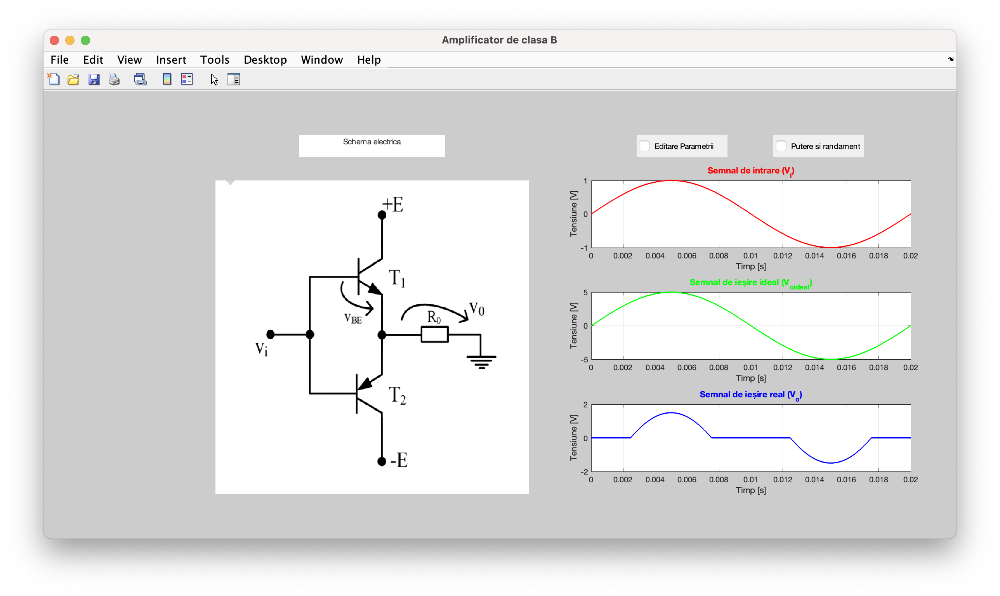
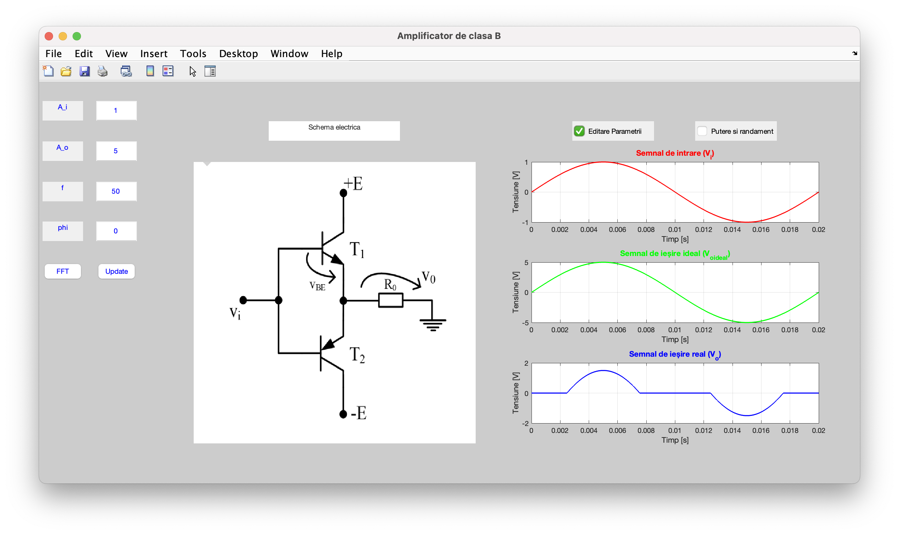
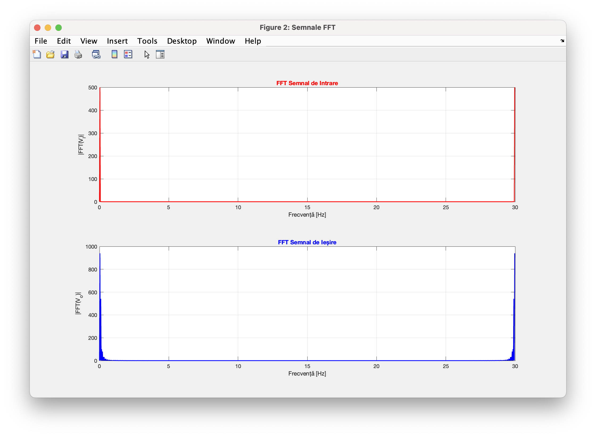
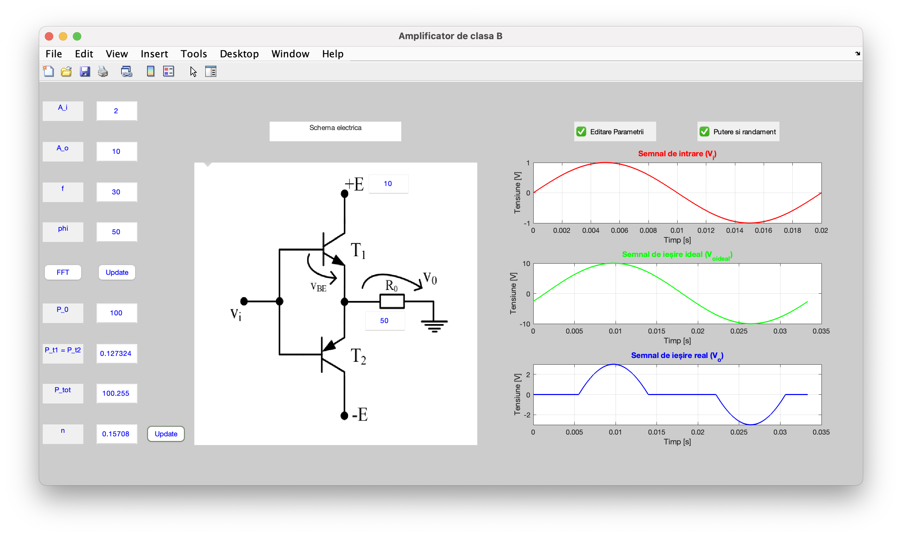

<h1 align="center">Analizor pentru Amplificatoare de Clasa B- MATLAB GUI</h1>

  
  
  

---

 <h2>Descriere Proiect</h2>

  Acest proiect constă într-o aplicație dezvoltată în MATLAB care permite simularea și analiza unui amplificator de putere în clasă B. 

  
Utilizatorul poate introduce parametrii circuitului și poate vizualiza instantaneu caracteristicile dinamice și eficiența energetică a acestuia.
  

Funcționalitățile cheie sunt: 

<ul>
  <li>Analiza dinamică care presupune calculul puterii de ieșire (Pout), puterii absorbite de la sursă (PCC) și puterii disipate (Pd).</li>
  <li>Randamentul care presupune Calculul și afișarea randamentului (η) în funcție de amplitudinea semnalului.</li>
  <li>Interfața interactivă care presupune modificarea parametrilor în timp real prin elemente de control grafic (slider, edit fields).</li>
</ul>

---

<h2>Prezentare Interfață</h2>
Aplicația oferă o vizualizare clară a punctelor de funcționare și a limitărilor de putere, conform capturilor de ecran din folderul dedicat:

  
  
  

   
   
   

---

<h2> Languages and Tools:</h2>
<a href="https://www.mathworks.com/" target="_blank" rel="noreferrer">
     MatLab

  </a>
  
---

  <i>Realizat de Mădărășan Ioan-Alexandru</i>

